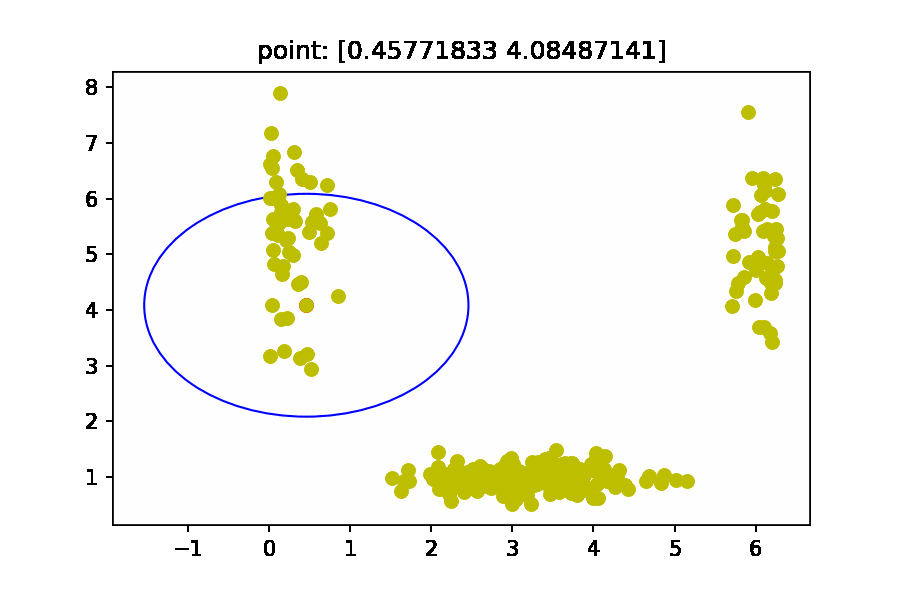

# Mean Shift Algorithm

Mean shift is a non-parametric feature-space analysis technique for locating the maxima of a density function, a so-called mode-seeking algorithm. Application domains include cluster analysis in computer vision and image processing.

{loop=""}